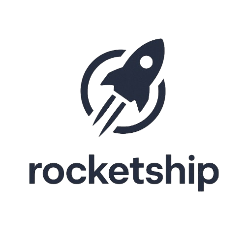

<p align="center">
  <a href="https://docs.rocketship.sh">
    <picture>
      <source media="(prefers-color-scheme: dark)" srcset="docs/misc/assets/transparent-reverse.png">
      <source media="(prefers-color-scheme: light)" srcset="docs/misc/assets/transparent.png">
      
    </picture>
  </a>
</p>
<h3 align="center">E2E API Testing For Any Cloud Environment</h3>
<p align="center">Run Enterprise-Grade e2e Tests With a Single Command</p>

<p align="center">
  <a href="https://github.com/rocketship-ai/rocketship/releases"></a>
  <a href="https://github.com/rocketship-ai/rocketship/actions/workflows/all.yml"></a>
  <a href="https://goreportcard.com/report/github.com/rocketship-ai/rocketship"></a>
  <br>
</p>
<p align="center">
    <a href="https://github.com/rocketship-ai/rocketship/releases">Download</a> ·
    <a href="https://docs.rocketship.sh">Documentation</a> ·
</p>

🚀 Rocketship is an **open‑source testing engine** that can verify complex, API-driven scenarios that are made by your customers— or your systems. Today's world is filled with event-driven micro-services that can be hard to test. Rocketship brings durable execution backed by **Temporal** to your testing infra, and offers an extensible plugin system so you can add the APIs and protocols that matter to you.

Define your test scenarios as declarative YAML specs **->** and have Rocketship run them locally or in your cloud environment. Your choice!

Core features include:

- **Configurable load generation.** Even lower-end machines can simulate lots of traffic.
- **Tests as code.** Reuse scripts, modularize logic, version control, and integrate tests with your CI.
- **A full-featured API.** The scripting API is packed with features that help you simulate real application traffic.
- **An embedded JavaScript engine.** The performance of Go, the scripting familiarity of JavaScript.
- **Multiple Protocol support**. HTTP, WebSockets, gRPC, Browser, and more.
- **Large extension ecosystem.** You can extend k6 to support your needs. And many people have already shared their extensions with the community!
- **Flexible metrics storage and visualization**. Summary statistics or granular metrics, exported to the service of your choice.
- **Native integration with Grafana cloud**. [SaaS solution](https://grafana.com/products/cloud/k6/) for test execution, metrics correlation, data analysis, and more.

This is what load testing looks like in the 21st century.

## Example script

```js
import http from "k6/http";
import { check, sleep } from "k6";

// Test configuration
export const options = {
  thresholds: {
    // Assert that 99% of requests finish within 3000ms.
    http_req_duration: ["p(99) < 3000"],
  },
  // Ramp the number of virtual users up and down
  stages: [
    { duration: "30s", target: 15 },
    { duration: "1m", target: 15 },
    { duration: "20s", target: 0 },
  ],
};

// Simulated user behavior
export default function () {
  let res = http.get("https://quickpizza.grafana.com");
  // Validate response status
  check(res, { "status was 200": (r) => r.status == 200 });
  sleep(1);
}
```

You can run scripts like this on the CLI, or in your CI, or across a Kubernetes cluster.

## Documentation

The docs cover all aspects of using k6. Some highlights include:

- [Get Started](https://grafana.com/docs/k6/latest/). Install, run a test, inspect results.
- [HTTP requests](https://grafana.com/docs/k6/latest/using-k6/http-requests/). Have your virtual users use HTTP methods.
  Or, check the other [Protocols](https://grafana.com/docs/k6/latest/using-k6/protocols/).
- [Thresholds](https://grafana.com/docs/k6/latest/using-k6/thresholds/). Set goals for your test, and codify your SLOs.
- [Options](https://grafana.com/docs/k6/latest/using-k6/k6-options/). Configure your load, duration, TLS certificates, and much, much more.
- [Scenarios](https://grafana.com/docs/k6/latest/using-k6/scenarios/).
  Choose how to model your workload: open models, closed models, constant RPS, fixed iterations, and more.
- [Results output](https://grafana.com/docs/k6/latest/results-output/). Study, filter, and export your test results.
- [JavaScript API](https://grafana.com/docs/k6/latest/javascript-api/). Reference and examples of all k6 modules.
- [Extensions](https://grafana.com/docs/k6/latest/extensions/). Extend k6 for new protocols and use cases.

These links barely scratch the surface! If you're looking for conceptual information, you can read about [Test types](https://grafana.com/docs/k6/latest/testing-guides/test-types/), [Test strategies](https://grafana.com/docs/k6/latest/testing-guides/), or one of the many informative [Blog posts](https://k6.io/blog).

## Roadmap

Our team is dedicated to continuously improving and providing the best user experience possible. The [public roadmap](https://github.com/orgs/grafana/projects/443/views/1) covers user-oriented features, UX improvements and JavaScript support that our team will focus on. Remember that timeframes and priorities may shift, but we believe it's important to share our vision.

We hope it provides a clear overview of our plans for future development. We welcome feedback, corrections, and suggestions via GitHub to make it more comprehensive, accessible, and valuable for the community.

It's worth mentioning that we consider [upvotes (thumbs-up)](https://github.com/grafana/k6/issues?q=is%3Aissue+is%3Aopen+sort%3Areactions-%2B1-desc) to be one of the essential metrics for determining community needs. If you want to show us the importance of a feature, please give it a thumbs-up.

## Contribute

If you want to contribute or help with the development of k6, start by reading [CONTRIBUTING.md](CONTRIBUTING.md). Before you start coding, it might be a good idea to first discuss your plans and implementation details with the k6 maintainers—especially when it comes to big changes and features. You can do this in the [GitHub issue](https://github.com/grafana/k6/issues) for the problem you're solving (create one if it doesn't exist).

> **Note:** To disclose security issues, refer to [SECURITY.md](SECURITY.md).

## Support

To get help, report bugs, suggest features, and discuss k6 with others, refer to [SUPPORT.md](SUPPORT.md).

## License

k6 is distributed under the [AGPL-3.0 license](https://github.com/grafana/k6/blob/master/LICENSE.md).
