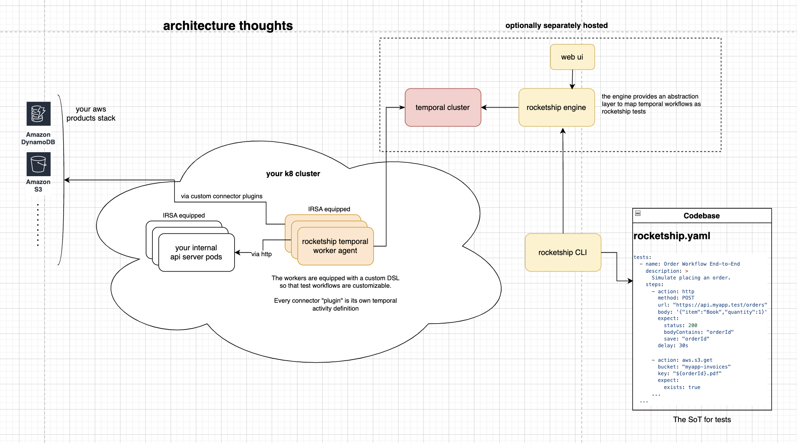

# Deploying Rocketship on Kubernetes

This guide covers deploying Rocketship on Kubernetes for production use.

## Prerequisites

- Kubernetes cluster (v1.20 or later)
- kubectl configured
- Helm v3 installed
- StorageClass for persistent volumes

## Architecture

The Kubernetes deployment of the Rocketship architecture can be thought of like this:



## Deployment Steps

### 1. Create Namespace

```bash
kubectl create namespace rocketship
```

### 2. Deploy Temporal

We recommend using the official Temporal Helm chart:

```bash
# Add Temporal Helm repo
helm repo add temporal https://temporal.github.io/helm-charts
helm repo update

# Install Temporal
helm install temporal temporal/temporal \
  --namespace rocketship \
  --set server.replicaCount=1 \
  --set cassandra.config.cluster_size=1 \
  --set prometheus.enabled=true \
  --set grafana.enabled=true
```

### 3. Deploy Rocketship Engine

Create `engine-deployment.yaml`:

```yaml
apiVersion: apps/v1
kind: Deployment
metadata:
  name: rocketship-engine
  namespace: rocketship
spec:
  replicas: 1
  selector:
    matchLabels:
      app: rocketship-engine
  template:
    metadata:
      labels:
        app: rocketship-engine
    spec:
      containers:
        - name: engine
          image: rocketshipai/rocketship-engine:latest
          ports:
            - containerPort: 7700
            - containerPort: 7701
          env:
            - name: TEMPORAL_HOST
              value: temporal-frontend.rocketship:7233
          resources:
            requests:
              cpu: "100m"
              memory: "128Mi"
            limits:
              cpu: "500m"
              memory: "512Mi"
---
apiVersion: v1
kind: Service
metadata:
  name: rocketship-engine
  namespace: rocketship
spec:
  selector:
    app: rocketship-engine
  ports:
    - name: grpc
      port: 7700
      targetPort: 7700
    - name: http
      port: 7701
      targetPort: 7701
  type: ClusterIP
```

Apply the configuration:

```bash
kubectl apply -f engine-deployment.yaml
```

### 4. Deploy Rocketship Worker

Create `worker-deployment.yaml`:

```yaml
apiVersion: apps/v1
kind: Deployment
metadata:
  name: rocketship-worker
  namespace: rocketship
spec:
  replicas: 3 # Adjust based on your needs
  selector:
    matchLabels:
      app: rocketship-worker
  template:
    metadata:
      labels:
        app: rocketship-worker
    spec:
      containers:
        - name: worker
          image: rocketshipai/rocketship-worker:latest
          env:
            - name: TEMPORAL_HOST
              value: temporal-frontend.rocketship:7233
          resources:
            requests:
              cpu: "100m"
              memory: "128Mi"
            limits:
              cpu: "500m"
              memory: "512Mi"
```

Apply the configuration:

```bash
kubectl apply -f worker-deployment.yaml
```

### 5. Configure Ingress (Optional)

If you need external access to the engine:

```yaml
apiVersion: networking.k8s.io/v1
kind: Ingress
metadata:
  name: rocketship-engine
  namespace: rocketship
  annotations:
    nginx.ingress.kubernetes.io/ssl-redirect: "true"
spec:
  rules:
    - host: rocketship.your-domain.com
      http:
        paths:
          - path: /
            pathType: Prefix
            backend:
              service:
                name: rocketship-engine
                port:
                  number: 7700
```

## Monitoring

### 1. Set up Prometheus monitoring:

```yaml
apiVersion: monitoring.coreos.com/v1
kind: ServiceMonitor
metadata:
  name: rocketship
  namespace: rocketship
spec:
  selector:
    matchLabels:
      app: rocketship-engine
  endpoints:
    - port: grpc
      interval: 15s
```

### 2. Configure logging:

```yaml
apiVersion: logging.banzaicloud.io/v1beta1
kind: Flow
metadata:
  name: rocketship-logs
  namespace: rocketship
spec:
  filters:
    - parser:
        remove_key_name_field: true
        parse:
          type: json
  match:
    - select:
        labels:
          app: rocketship-engine
          app: rocketship-worker
  localOutputRefs:
    - loki-output
```

## Troubleshooting

### Common Issues

1. **Worker Connection Issues**:

   ```bash
   kubectl logs -n rocketship -l app=rocketship-worker
   ```

2. **Engine Service Issues**:

   ```bash
   kubectl logs -n rocketship -l app=rocketship-engine
   ```

3. **Temporal Issues**:

   ```bash
   kubectl logs -n rocketship -l app=temporal-frontend
   ```

### Health Checks

```bash
# Check pod status
kubectl get pods -n rocketship

# Check service endpoints
kubectl get endpoints -n rocketship

# Check logs
kubectl logs -n rocketship -l app=rocketship-engine
```

## Next Steps

- [Command Reference](./reference/rocketship.md)
- [Examples](./examples.md)
